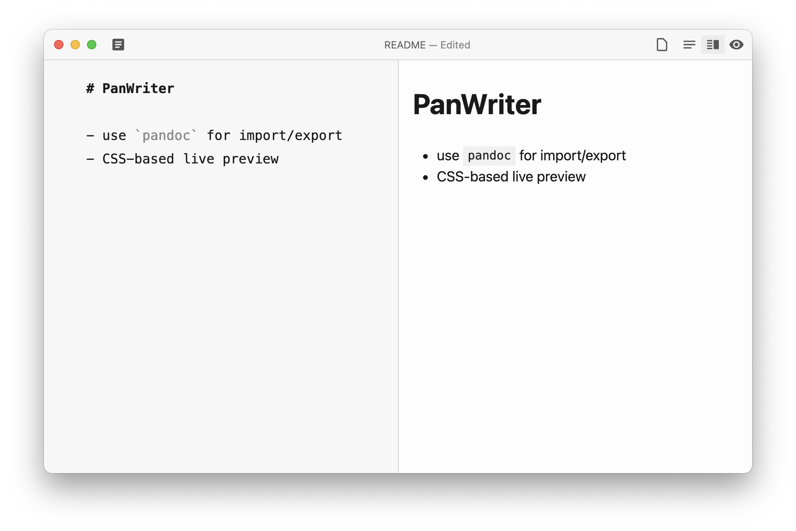
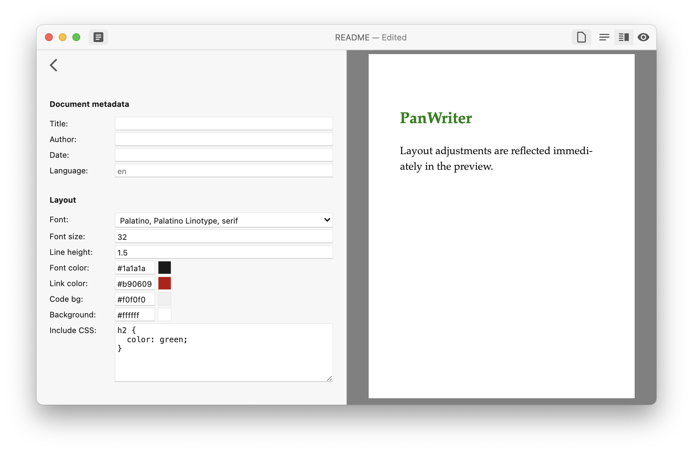
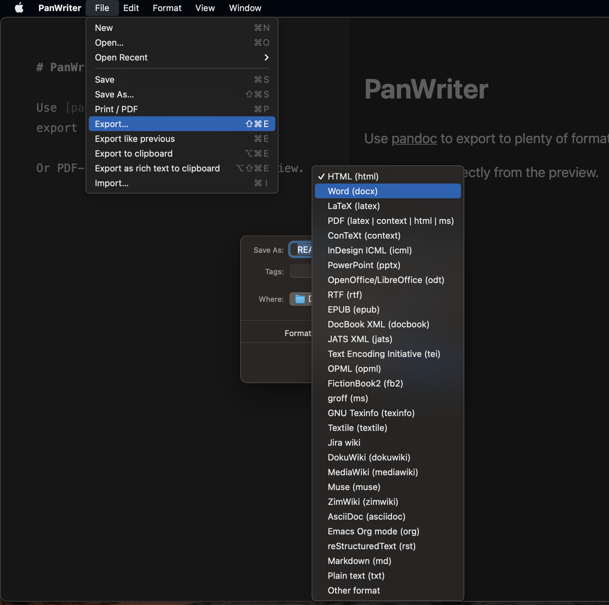

# PanWriter

PanWriter is a distraction-free markdown editor with two unique features:

1. Tight integration with pandoc for import/export to/from plenty of file formats (including HTML, docx, LaTeX and EPUB).
2. Preview pane that can show pages – including page breaks etc. Layout adjustments are immediately reflected in the preview.

**[Download PanWriter](https://github.com/mb21/panwriter/releases)**

You also have to [install pandoc](https://pandoc.org/installing.html) to export to most formats.

PanWriter is very usable, but also very much a work in progress, as there are still a few rough edges (see [TODOs below](#todos)). Feedback, suggestions and contributions very much welcome! Please open an issue to start a conversation.

## Usage

### Export preview to PDF

Select `File -> 'Print / PDF'` and `PDF -> 'Save as PDF'` in the print dialog (exact naming might depend on your OS).

This will export exactly what’s shown in the preview, and not use pandoc at all.

You can change the styling of the preview and immediately see the changes. (You can later save your CSS as a theme, see [Document types](#document-types--themes) below.)

### Export via pandoc

First, install the [latest pandoc version](http://pandoc.org/installing.html), then:

Select `File -> Export` and choose a format.

If you have a YAML metadata block, like in the following example, PanWriter will look at the extension of the filename you chose in the dialog, and look up the corresponding key in the `output` YAML metadata, for example when exporting the following markdown to `test.html`:

    ---
    title: my document
    fontsize: 18px
    pdf-format: latex  # optional
    output:
      html:
        katex: true  # for math output
        include-in-header:
          - foo.css
          - bar.js
      latex:
        pdf-engine: xelatex
        toc: true
        toc-depth: 3
        template: letter.tex
        metadata:
          fontsize: 12pt
      epub:
        to: epub2  # default would be epub3
    ---

    # my document

this command will be executed:

    pandoc --toc --include-in-header foo.css --include-in-header bar.js --output test.html --to html --standalone

See the [pandoc user's guide](http://pandoc.org/MANUAL.html) for available options.

There are two exceptions to the rule that the key in the `output` YAML is the file extension:

1. When exporting to a `.tex` file, the key should be named `latex`.
2. When exporting to a `.pdf` file, the key for PanWriter to look up in the `output` YAML can be specified with the `pdf-format` key (see example above). Default is also `latex`, but you can also use `context`, `html`, `ms`, `beamer`, `revealjs`, etc.  In fact, you could set it to anything, if you had a corresponding key in the `output` YAML with a `to:` field. See also [Creating a PDF with pandoc](http://pandoc.org/MANUAL.html#creating-a-pdf).

### User Data Directory

You can place certain files in the PanWriter user directory, which [should be](https://electronjs.org/docs/api/app#appgetpathname):

- macOS: `/Users/your-user-name/Library/Application Support/PanWriterUserData`
- Linux: `~/.config/PanWriterUserData`
- Windows: `C:\Users\your-user-name\AppData\Local\PanWriterUserData`

If the directory does not exist, you can create it.

### Default CSS and YAML

PanWriter will look for a `default.css` file in the user data directory, to load CSS for the preview. If that file is not found, it will use sensible defaults.

If you put a `default.yaml` file in the data directory, PanWriter will merge this with the YAML in your input file (to determine the command-line arguments to call pandoc with) and add the `--metadata-file` option. The YAML should be in the same format as above.

### Document types / themes

You can e.g. put `type: letter` in the YAML of your input document. In that case, PanWriter will look for `letter.yaml` and `letter.css` instead of `default.yaml` and `default.css` in the user data directory.

### Markdown syntax

We use `markdown-it` for the preview pane, which is fully [CommonMark](https://commonmark.org/)-compliant. It supports [GFM](https://github.github.com/gfm/) tables (basically pandoc `pipe_tables`) and GFM Strikethrough (`strikeout`) out of the box. We also added a [bunch of plugins](https://github.com/mb21/markdown-it-pandoc), to make the preview behave as much as pandoc as possible (including attributes, [`fenced_divs`](http://pandoc.org/MANUAL.html#extension-fenced_divs), `definition_lists`, `footnotes`, `grid_tables`, `implicit_figures`, `subscript`, `superscript`, `yaml_metadata_block` and `tex_math_dollars`). We explicitly don't support `raw_html` or `raw_tex`, since everything should be doable with the `fenced_divs`, `bracketed_spans` and `raw_attribute` extensions.

However, there might still be minor differences between the preview and `File -> 'Print / PDF'` on one hand, and `File -> Export` on the other.

Things we should emulate in the preview, but for which there are [no markdown-it plugins yet](https://github.com/atom-community/markdown-preview-plus/wiki/markdown-it-vs.-pandoc):

- [`raw_attribute`](http://pandoc.org/MANUAL.html#extension-raw_attribute): we should probably just strip them from preview
- backslash at end of paragraph, e.g. ` \` An ugly workaround that already works is ` &nbsp;`

Pandoc markdown supports a few more things which will not render correctly in the preview, but which are not so commonly used. However, you can still use them in your markdown file, and export via pandoc will work.

### Launching from the command-line

You can set up your system to launch PanWriter with:

    panwriter myfile.md

On macOS, you should put the following in your `~/.bash_profile` or similar:

    function panwriter(){ open -a PanWriter "$@"; }

On Linux and Windows, you can make an alias to the correct location of the `panwriter` executable.

## About CSS for print

Unfortunately, still no browser fully implements the CSS specs for paged media (paged media are e.g. print or PDF). Therefore, PanWriter's preview is powered by [pagedjs](https://gitlab.pagedmedia.org/tools/pagedjs) – a collection of paged media polyfills by [pagedmedia.org](https://pagedmedia.org). Some background on using CSS for print:

- [Motivating article on A List Apart](https://alistapart.com/article/building-books-with-css3)
- [Print-CSS resources, tools](https://print-css.rocks)
- [W3C Paged Media Module](https://www.w3.org/TR/css-page-3/)
- [W3C Generated Content for Paged Media](https://www.w3.org/TR/css-gcpm-3/)

## Develop

Install [yarn](https://yarnpkg.com/), then:

    ## Download source code
    git clone git@github.com:mb21/panwriter.git
    cd panwriter

    ## Install npm dependencies, PureScript compiler, etc
    yarn install

    ## Build the PureScript project
    yarn build

    ## To run the app in development mode:
    yarn start

    ## To build distributable app package (goes to ./dist):
    yarn dist

### TODOs

- Preview:
    - respect `css`, `toc` metadata fields
- Editor:
    - expand `Format` menu
    - spell check
    - improve find/replace
- add a Settings/Preferences window (or should this just be a `settings.yaml` file?) where you can:
    - set a CodeMirror editor theme css
    - edit the default CSS and YAML files
    - choose `pandoc` executable (probably with file-open dialog, which we can use for app sandboxing with security-scoped bookmarks)
- Write pandoc lua filter that does some PanWriter-specific transformations:
  - add [page-break syntax](https://github.com/jgm/pandoc/issues/1934#issuecomment-274327751)
  - [Variable substitution in body](https://github.com/jgm/pandoc/issues/1950#issuecomment-427671251)
  - read out `type` metadata and if it references a css file, put the path into the `css` metadata variable
- GUI popup on file import: at least allow to set `-f`, `-t`, `--track-changes` and `--extract-media` pandoc options.
- Unify PanWriter custom document type and pandoc template concepts?
- Rename `type` metadata key to `doctype`?

## Powered by

PanWriter is powered by (amongst other open source libraries):

- [pandoc](http://pandoc.org) (import/export)
- [Electron](https://electronjs.org) (app framework)
- [CodeMirror](https://codemirror.net) (editor)
- For the preview pane:
    - [pagedjs](https://gitlab.pagedmedia.org/tools/pagedjs)
    - [markdown-it](https://github.com/markdown-it/markdown-it#markdown-it)
    - [KaTeX](https://katex.org)
